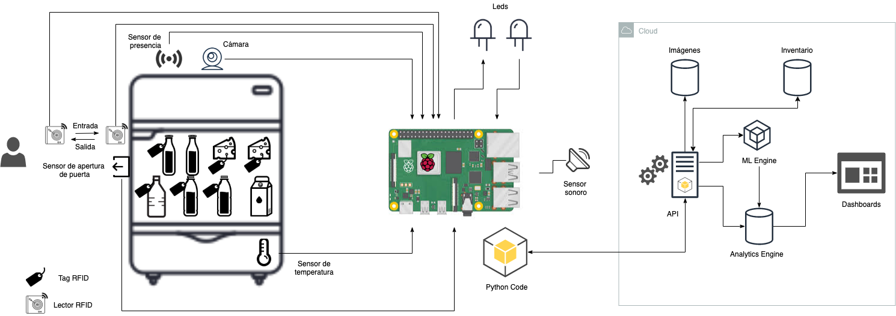

# Reto Semana i: IoT en el Supermercado

**Autores:**
- Rubén Raya Delgado
- David Iturriaga Sotelo
- Vicente Cubells Nonell

## 1. Descripción

Desarrollar un modelo de IoT para supermercados, que permita generar programas de lealtad personalizados y hacer más eficiente el manejo de inventarios, mediante el uso de Internet of Things y Machine Learning.

Para más detalles, favor de consultar la [presentación](https://docs.google.com/presentation/d/1WkP91aRNtllNfa_8uGCrdDcFe_ZRRd5CVMuEmkX4h4w/edit?usp=sharing).

## 2. Requerimientos

### 2.1. Hardware requerido

- Laptop o desktop
- [Raspberry Pi 1/2/3/4 Model B](https://www.raspberrypi.org/products)
- [Raspberry PI Universal Power Supply](https://www.raspberrypi.org/products/raspberry-pi-universal-power-supply/)
- Tarjeta MicroSD 8GB+
- Lector de MicroSD
- [Teclado USB](https://www.raspberrypi.org/products/raspberry-pi-keyboard-and-hub/)
- [Mouse USB](https://www.raspberrypi.org/products/raspberry-pi-mouse/)
- Cable microUSB a USB-A
- Monitor HDMI
- [Cable micro HDMI a HDMI](https://www.raspberrypi.org/products/micro-hdmi-to-standard-hdmi-a-cable/)
- Cable cruzado RJ45 a RJ45
- Webcam o [Raspberry Pi cámara](https://www.raspberrypi.org/products/camera-module-v2/)
- Sensor de movimiento PIR
- Sensor ultrasónico
- Sensor de apertura de puertas
- Sensor de temperatura
- Buzzer
- Tags RFID
- Lector RFID
- Sensor de presión
- Leds de diferentes colores
- Cables de conexión (jumpers)
- Protoboard

### 2.2. Software requerido

- [Ubuntu Linux](https://ubuntu.com/) o [MacOS](https://www.apple.com/mx/macos/catalina/)
- [Raspbian](https://www.raspberrypi.org/downloads/raspbian/)
- [Git](https://git-scm.com/)
- [Python 3.7](https://www.python.org/downloads/)
- [pip](https://pypi.org/project/pip/)
- [Google Cloud SDK](https://cloud.google.com/sdk/downloads)
- [OpenSSL](https://www.openssl.org/)
- Paquetes de Linux: `build-essential, libssl-dev, python-dev, libff-dev`
- Paquetes de Python: `datetime, time, jwt, paho-mqtt, pyjwt, cryptography, random, virtualenv`

## 2. Esqueleto de la arquitectura propuesta

## 3. Demos

### [Demo 1. Preparación de la Raspberry Pi](demo_01/)

### [Demo 2. Conexión de sensores básicos](demo_02)

### [Demo 3. Captura de imágenes y almacenamiento en la nube](demo_03/)

### [Demo 4. Clasificación de imágenes con Machine Learning](demo_04/)

### [Demo 5. Ingesta de datos de sensores en la nube](demo_05/)

### [Demo 6. Procesamiento y almacenamiento de datos en la nube](demo_06/)

### [Demo 7. Generación de tableros analíticos](demo_07/)

