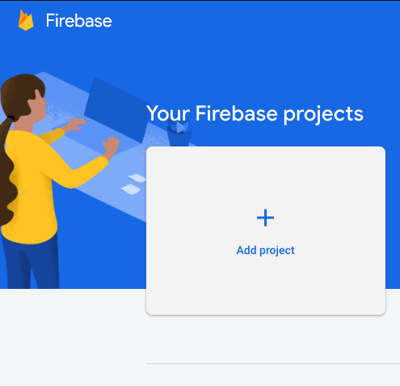
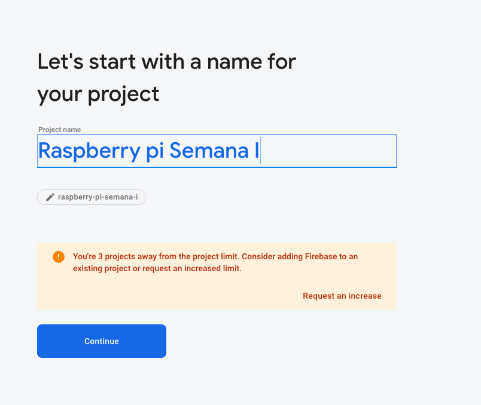
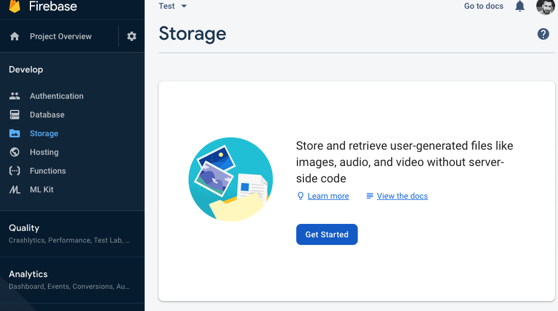
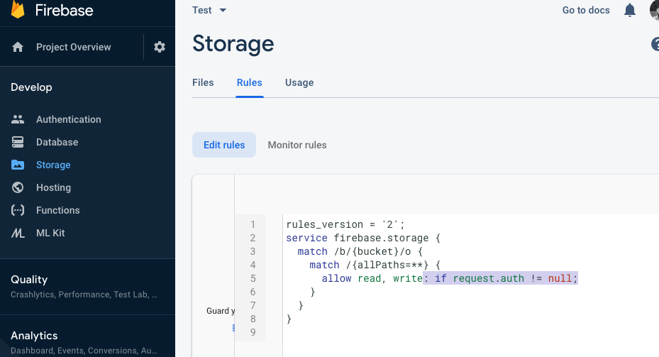
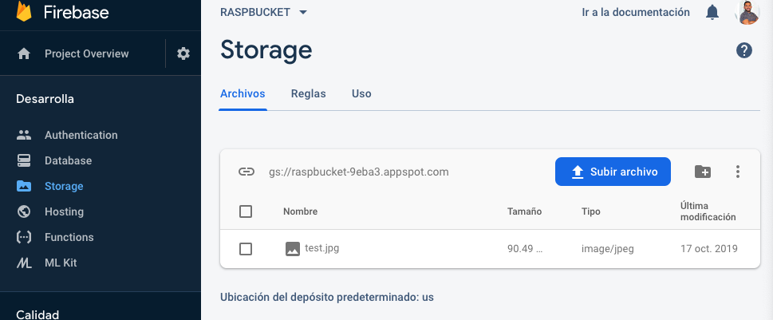

# Demo 3. Captura de imágenes y almacenamiento en la nube

Este demo podremos utilizar un script que capture una imagen desde una [Webcam USB](https://www.raspberrypi.org/documentation/usage/webcams/) que posteriormente se enviara a un repositorio en [Firebase](https://firebase.google.com)

## 1. Pre-requisitos

* Una laptop o desktop con Linux o MacOS.
* Tener instalado `git`, `python 3.7`, `pip`, `wget` y `openssl`.
* Acceso a Internet.
* Cuenta de [Google](https://console.firebase.google.com) para acceder a la consola de desarrollador.

## 2. Estructura del proyecto

A continuación se describen los archivos que forman parte del demo, así como la función que juega cada uno de ellos:

* [fswebcam](https://www.raspberrypi.org/documentation/usage/webcams/): Comando que permite ejecutar la captura de imagen de una webcam. 
* [Firebase_upload_file](02_Firebase_upload.py): Codigo base para enviar una imagen.

## 3. Instrucciones de uso

* 1.- Instalar el paquete [fswebcam](https://www.raspberrypi.org/documentation/usage/webcams/) 

    `sudo apt install fswebcam
` 
* 2.- Ejecutar el comando y validar que guarde la imagen
    
    `fswebcam -r 1280x720 --no-banner image.jpg`
* 3.- Entrar a la consola de desarrollador y crear un proyecto en [Firebase](https://firebase.google.com/) 

        

        * Dar un nombre al proyecto.

    
    
        * Crear un nuevo almacenamiento.
    
    

        * Eliminar las siguientes lineas de las reglas del almacenamiento.
    
    

        * Configurar el script en python para probar los recursos.

### 3.4. Felicidades!!! 
`Has completado el demo satisfactoriamente.`

## 4. Recursos

Cuenta en Google.

Acceso a la Consola de Google.

Acceso a Google Storage

Usb Webcam 

Script [Firebase_upload](02_Firebase_upload.py)