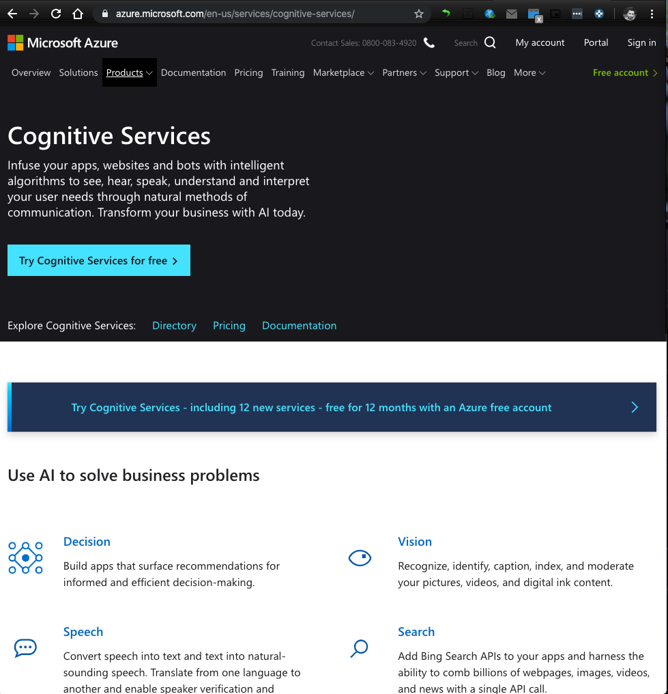
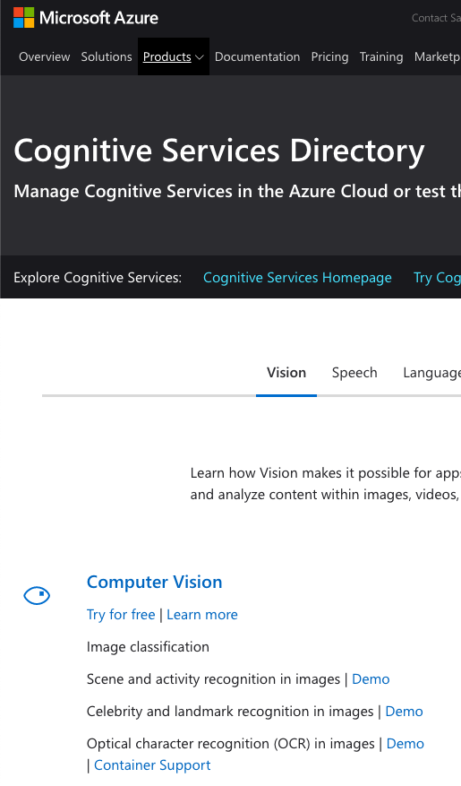
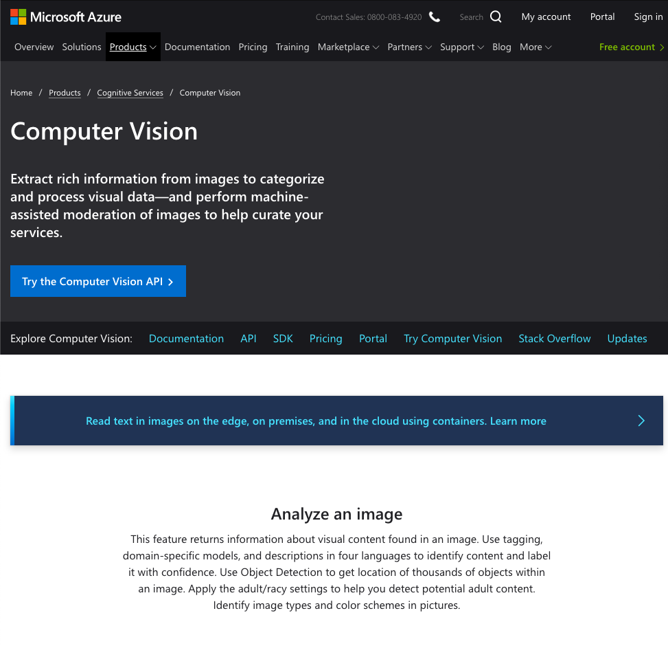
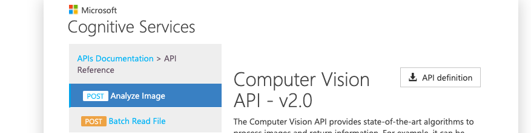
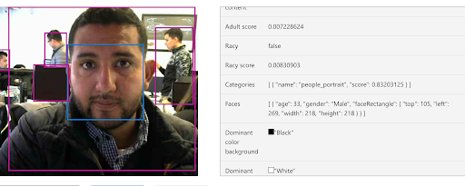

# Demo 4. Clasificación de imágenes con Machine Learning

Este demo utilizaremos la practica [Firebase_upload](02_Firebase_upload.py) para utilizar el archivo imagen que almacenamos previamente, para analizarla con servicios Microsoft Azure [Cognitive Services](https://azure.microsoft.com/en-us/services/cognitive-services/)

## 1. Pre-requisitos

* Una laptop o desktop con Linux o MacOS.
* Tener instalado `git`, `python 3.7`, `pip`, `wget` y `openssl`.
* Acceso a Internet.
* Cuenta de [Google](https://console.firebase.google.com) para acceder a la consola de desarrollador.
* Cuenta de [Microsoft](https://azure.microsoft.com/en-us/services/cognitive-services/computer-vision/) para acceder los servicios cognitivos avanzados.

## 2. Estructura del proyecto

A continuación se describen los archivos que forman parte del demo, así como la función que juega cada uno de ellos:

* [fswebcam](https://www.raspberrypi.org/documentation/usage/webcams/): Comando que permite ajecutar la captura de imagen de una webcam. 
* [Firebase_upload_file](02_Firebase_upload.py): Codigo base para enviar una imagen.
* [Cognitive_services](03_cognitive_services.py): Codigo base para enviar una imagen.
* [API de prueba](https://westus.dev.cognitive.microsoft.com/docs/services/5adf991815e1060e6355ad44/operations/56f91f2e778daf14a499e1fa): Analizar el funcionamiento del API

## 3. Instrucciones de uso

* Acceder al portal de [Microsoft Cognitive Services](https://azure.microsoft.com/en-us/services/cognitive-services/).

    

* Seleccionar [Vision](https://azure.microsoft.com/en-us/services/cognitive-services/directory/vision/).

    

* Seleccionar [Computer Vision](https://azure.microsoft.com/en-us/services/cognitive-services/computer-vision/).

    

* Seleccionar la opción [API](https://westus.dev.cognitive.microsoft.com/docs/services/5adf991815e1060e6355ad44/operations/56f91f2e778daf14a499e1fa).

    

* Desplazarse  hasta el final de la pagina y ver el ejemplo para [python](https://westus.dev.cognitive.microsoft.com/docs/services/5adf991815e1060e6355ad44/operations/56f91f2e778daf14a499e1fa).

    

* Acceder al ejemplo [Cognitive_Services](03_cognitive_services.py) y configurar el servicio previo.

### 3.4. Felicidades!!! 
Has completado el demo satisfactoriamente.

## 4. Recursos

* Comando [fswebcam](https://www.raspberrypi.org/documentation/usage/webcams/)
* [Firebase_upload_file](02_Firebase_upload.py) 
* [Cognitive_services_file](03_cognitive_services.py)
* Microsoft Azure Cognitive Services [API](https://westus.dev.cognitive.microsoft.com/docs/services/5adf991815e1060e6355ad44/operations/56f91f2e778daf14a499e1fa)
