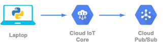
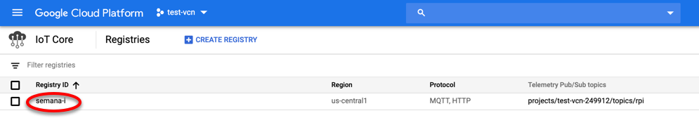

# Demo 5. Ingesta de datos de sensores en la nube

Este demo muestra como ingestar datos de sensores en un servicio en la nube utilizando [Cloud IoT](https://cloud.google.com/solutions/iot/) y [Pub/Sub](https://cloud.google.com/pubsub/) en [Google Cloud Platform](https://cloud.google.com/). 



## 1. Pre-requisitos

* Una laptop o desktop con Linux o MacOS.
* Tener instalado `git`, `python 3.7`, `pip`, `wget` y `openssl`.
* Tener una cuenta activa en [Google Cloud Platform](https://cloud.google.com/).
* Tener instalado el [Google Cloud SDK](https://cloud.google.com/sdk/).
* Acceso a Internet.


## 2. Estructura del proyecto

A continuación se describen los archivos que forman parte del demo, así como la función que juega cada uno de ellos:

- [simulate_rpi.py](simulate_rpi.py): Código en Python que simula la generación de lecturas de sensores y los envía al servicio de Cloud IoT utilizando el protocolo MQTT.
- [requirements.txt](requirements.txt): Archivo de dependencias.


## 3. Instrucciones de uso

### 3.1. Preparación del ambiente local

1. Abra una Terminal y descargue el repositorio a una carpeta de su laptop o desktop utilizando el comando:
 ```
 git clone https://github.com/vcubells/iot_supermercado.git
 ```
2. Cámbiese a la carpeta del demo:
```
cd iot_supermercado/demo_05
```
3. (Opcional) Instale los paquetes de Linux en caso de ser necesario:
```
sudo apt-get update
sudo apt-get install build-essential
sudo apt-get install libssl-dev
sudo apt-get install python-dev
sudo apt-get install libffi-dev
```
3. Active un ambiente virtual:
```
pip install virtualenv
virtualenv env
source env/bin/activate
``` 
4. Instale los paquetes de Python:
```
sudo pip install paho-mqtt
sudo pip install pyjwt
sudo pip install cryptography
```
5. Instale las dependencias:
```
pip install -r requirements.txt
```
6. Genere las llaves criptográficas necesarias par el servicio de Cloud IoT:
```
openssl req -x509 -newkey rsa:2048 -keyout demo_private.pem -nodes -out demo.pub -subj "/CN=unused"
```
7. Verifique que se generaron correctamente los archivos de la llave privada `demo_private.pem` y la llave pública `demo.pub`.
8. Descargue el certificado raíz:
```
wget https://pki.google.com/roots.pem
```

### 3.2. Generación de recursos en GCP

1. Cree un proyecto en la [Consola de Google Cloud Platform](https://console.cloud.google.com). Póngale el nombre y ID que usted prefiera. Copie el ID del proyecto y guárdelo porque lo utilizará más adelante.


2. Dentro de la  consola, en el menú de la izquierda, localice el grupo titulado **BIG DATA** y seleccione la opción IoT Core.


3. Cree un registro de dispositivos en Cloud IoT.


4. Cree un tópico nuevo en Pub/Sub.


5. Seleccione el registro recién creado.



6. Adicione un nuevo dispositivo dentro de la sección **Dispositivos** del registro creado.


7. Especifique los parámetros como se muestra en la siguiente figura. No olvide subir en la sección de *Autenticación* la llave pública (archivo `demo.pub`) que generó previamente.


8. Dentro de la  consola, en el menú de la izquierda, localice el grupo titulado **BIG DATA** y seleccione la opción Pub/Sub.


9. Localice el tópico creado en el paso 4 y dentro del menú de tres puntos que aparece a la derecha, seleccione la opción **Crear subscripción**.


10. Especifique los parámetros que aparecen señalados en la siguiente imagen y luego seleccione el botón **Crear**.


### 3.3. Ejecutar el demo en su laptop o desktop

1. Utilizando el editor de texto de su preferencia, edite el archivo `simulate_rpi.py`.
2. Localice la sección siguiente,  modifique las variables con sus propios valores y guarde los cambios realizados:
```
# Define some project-based variables
ssl_private_key_filepath = '/home/demo/iot_supermercado/demo_05/demo_private.pem'
ssl_algorithm = 'RS256'
root_cert_filepath = '/home/demo/iot_supermercado/demo_05/roots.pem'
project_id = 'semana-i-iot'
gcp_location = 'us-central1'
registry_id = 'semana-i'
device_id = 'rpi'
```
3. En la Terminal, ejecute el código con el comando:
```
python simulate_pi.py
```
4. Si todo está bien, verá en la pantalla una salida como la siguiente:


5. Verifique que los mensajes se están ingestando en el tópico de Pub/Sub correctamente:
```
gcloud beta pubsub subscriptions pull --auto-ack telemetry
```
Salida:


### 3.4. Felicidades!!! 
Has completado el demo satisfactoriamente.


## 4. Recursos

Para conocer más sobre Cloud IoT consulte la [documentación oficial](https://cloud.google.com/solutions/iot/).

Para conocer más sobre Pub/Sub consulte la [documentación oficial](https://cloud.google.com/pubsub/).

Para conocer más sobre Google Cloud Platform consulte la documentación oficial disponible en  [GCP Documentation](https://cloud.google.com/docs/).