# Demo 6. Procesamiento y almacenamiento de datos en la nube

Este demo muestra como ejecutar una función en [Cloud Functions](https://cloud.google.com/functions/) cada vez que se recibe un mensaje en [Pub/Sub](https://cloud.google.com/pubsub/) y como almacenar los datos recibidos en [BigQuery](https://cloud.google.com/bigquery/).

IMPORTANTE!!!

Este demo es una continuación del [demo_05](../demo_05), por lo tanto, utiliza los recursos generados en el mismo. Si aún no ha realizado el [demo_05](../demo_05), necesita comenzar por ahí.

## 1. Pre-requisitos

* Haber realizado el [demo_05](../demo_05).
* Una laptop o desktop con Linux o MacOS.
* Tener una cuenta activa en [Google Cloud Platform](https://cloud.google.com/).
* Tener instalado el [Google Cloud SDK](https://cloud.google.com/sdk/).
* Acceso a Internet.


## 2. Estructura del proyecto

A continuación se describen los archivos que forman parte del demo, así como la función que juega cada uno de ellos:

- [cloud_function.py](cloud_function.py): Código en Python de la función que recibe paquetes de Pub/Sub, los procesa y los almacena en BigQuery.
- [requirements.txt](requirements.txt): Archivo de dependencias.


## 3. Instrucciones de uso

### 3.1. Preparación del ambiente local

1. Abra una Terminal y descargue el repositorio a una carpeta de su laptop o desktop utilizando el comando:
 ```
 git clone https://github.com/vcubells/iot_supermercado.git
 ```
2. Cámbiese a la carpeta del demo:
```
cd iot_supermercado/demo_06
```
3. Asegúrese de haber realizado el [demo_05](../demo_05). En caso contrario, siga las orientaciones del mismo hasta completarlo satisfactoriamente.

### 3.2. Generación de recursos en GCP

1. Acceda a la [Consola de Google Cloud Platform](https://console.cloud.google.com) y seleccione el mismo proyecto utilizado en el [demo_05](../demo_05).

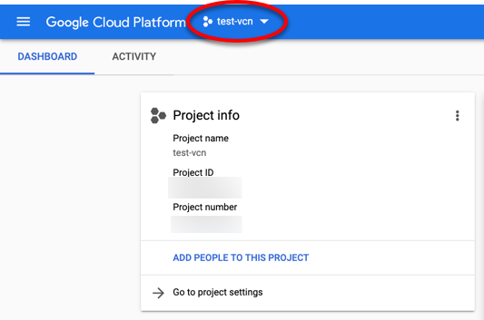

2. Dentro de la  consola, en el menú de la izquierda, localice el grupo titulado **COMPUTE** y seleccione la opción Cloud Functions.

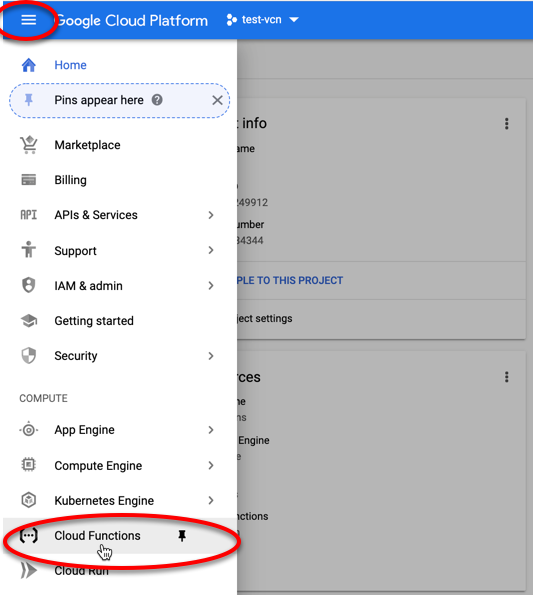

3. Cree una nueva función.

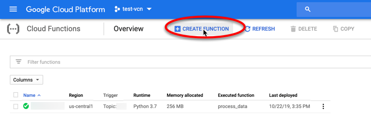

4. Establezca los valores tal como aparece en la siguiente imagen. Note los valores que hay que modificar señalados con una elipse de color rojo.

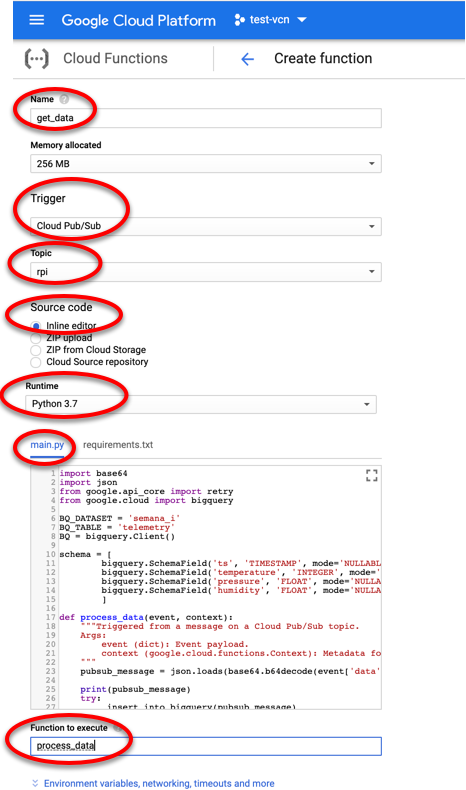

5. En la sección titulada **main.py** pegue el código que aparece en el archivo [`cloud_function.py`](cloud_function.py) del repositorio.

6. En la sección titulada **requirements.txt** pegue el código que aparece en el archivo [`requirements.txt`](requirements.txt) del repositorio.

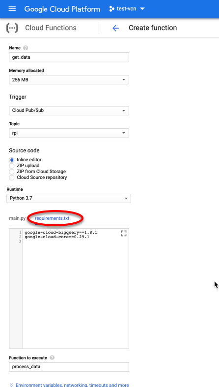

7. Por último, seleccione el botón **Crear**.

8. Dentro de la  consola, en el menú de la izquierda, localice el grupo titulado **BIG DATA** y seleccione la opción BigQuery.

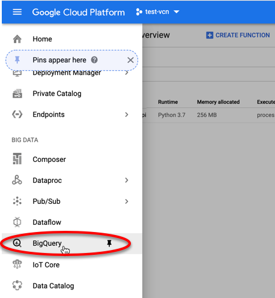

9. Localice el nombre de su proyecto y seleccione la opción **+Crear conjunto de datos**.

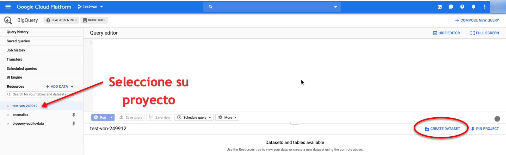

10. Especifique el nombre y luego seleccione el botón **Crear conjunto de datos**.

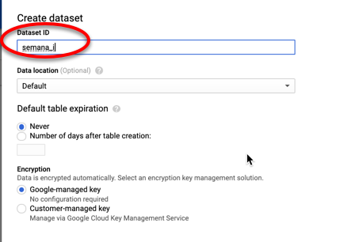

11. Seleccione el conjunto de datos y de clic en la opción **Crear tabla**.

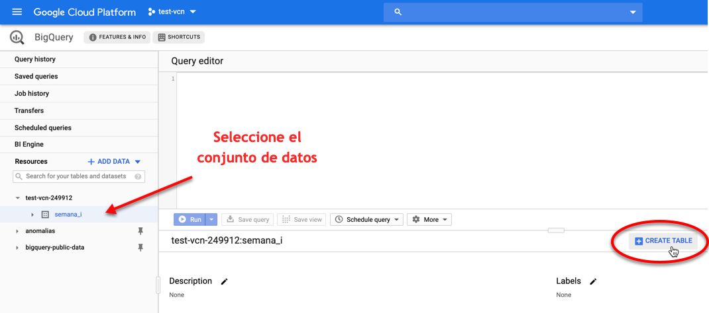

12. Especifique los valores tal como aparecen en la siguiente imagen y, porteriormente, de clic en la opción **Crear tabla**.

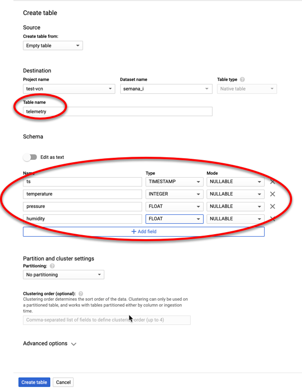

13. Seleccione el nombre de la tabla recién creada y en la sección **Esquema** verá la estructura de la misma.

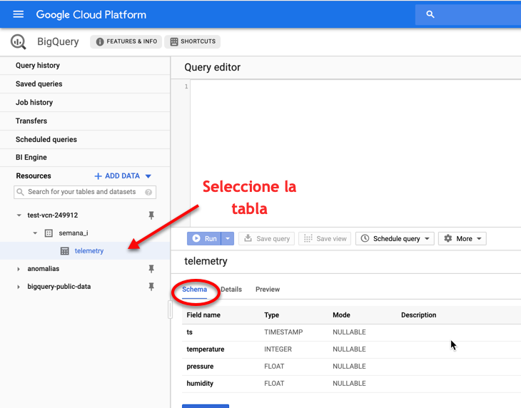

### 3.3. Ejecutar el demo en su laptop o desktop

1. En la Terminal, cámbiese a la carpeta del demo_05:
```
cd ../demo_05
```
2. Ejecute varias veces el código con el comando:
```
python simulate_pi.py
```

### 3.4. Visualizar los resultados en GCP

1. Acceda a la [Consola de Google Cloud Platform](https://console.cloud.google.com), en el menú de la izquierda, localice el grupo titulado **BIG DATA** y seleccione la opción BigQuery.


2. Localice el nombre de la tabla creada y seleccione la opción **Vista previa**. Deberá ver algunos registros similares a los que aparecen en la siguiente imagen:

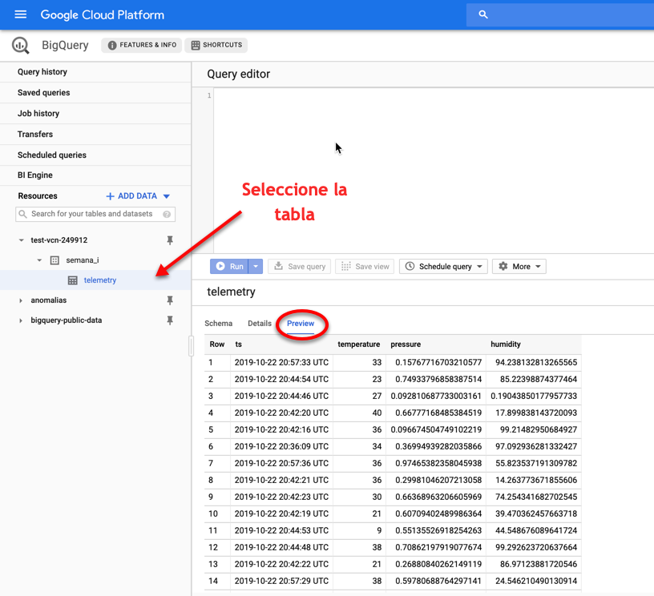


### 3.5. Felicidades!!! 
Has completado el demo satisfactoriamente.


## 4. Recursos

Para conocer más sobre Cloud Functions consulte la [documentación oficial](https://cloud.google.com/functions/).

Para conocer más sobre BigQuery consulte la [documentación oficial](https://cloud.google.com/bigquery/).

Para conocer más sobre Google Cloud Platform consulte la documentación oficial disponible en  [GCP Documentation](https://cloud.google.com/docs/).