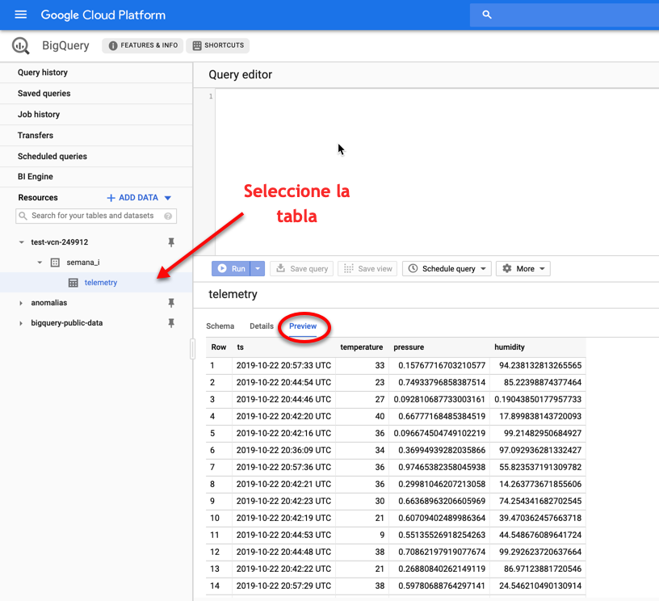
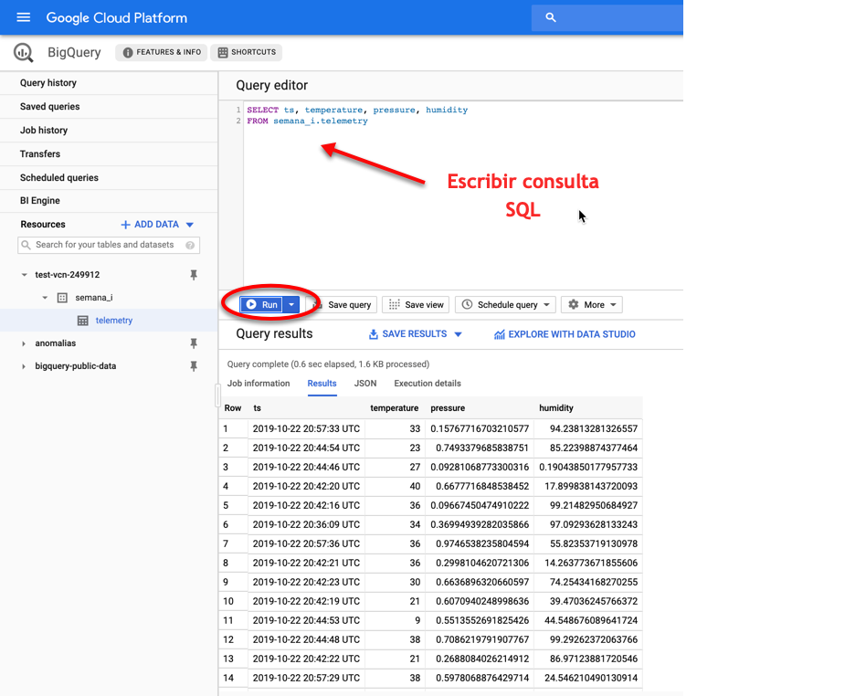

# Demo 7. Generación de tableros analíticos

Este demo muestra como ejecutar una consulta en [BigQuery](https://cloud.google.com/bigquery/) y, a partir de los resultados, generar un dashboard en [Data Studio](https://datastudio.google.com/).  

IMPORTANTE!!!

Este demo es una continuación del [demo_06](../demo_06), por lo tanto, utiliza los recursos generados en el mismo. Si aún no ha realizado el [demo_06](../demo_06), necesita comenzar por ahí.


## 1. Pre-requisitos

* Haber realizado el [demo_06](../demo_06).
* Una laptop o desktop con Linux o MacOS.
* Tener una cuenta activa en [Google Cloud Platform](https://cloud.google.com/).
* Tener instalado el [Google Cloud SDK](https://cloud.google.com/sdk/).
* Acceso a Internet.


## 2. Instrucciones de uso

### 2.1. Generación de tableros en Data Studio

1. Acceda a la [Consola de Google Cloud Platform](https://console.cloud.google.com) y seleccione el mismo proyecto utilizado en el [demo_06](../demo_06).


2. Dentro de la  consola, en el menú de la izquierda, localice el grupo titulado **BIG DATA** y seleccione la opción BigQuery.


3. Localice el nombre de la tabla creada y seleccione la opción **Vista previa**. Deberá ver algunos registros similares a los que aparecen en la siguiente imagen:



4. En el editor de consultas, escriba la siguiente sentencia SQL y de clic en el botón **Ejecutar**.

```sql
SELECT ts, temperature, pressure, humidity
FROM semana_i.telemetry
```



5. En la sección titulada **Resultados de la consulta** seleccione la opción **Explorar con Data Studio**.


6. Se abrirá la [Consola de Data Studio](https://datastudio.google.com). Modifique el nombre en la parte superior izquierda y, posteriormente, de clic en el nombre del dataset.


7. Seleccione el botón **Crear nueva fuente de datos**.


8. Seleccione la opción BigQuery.


9. Seleccione la tabla que contiene las mediciones de los sensores y luego seleccione el botón **Conectar**.


10. En la siguiente pantalla, modifique el tipo de dato del campo `ts` tal como se muestra en la imagen  y de clic en el botón **Aplicar**.


11. De clic en el menú de tres puntos que aparece a la izquierda y en el menú de opciones seleccione la opción **Eliminar**.


12. Adicione una nueva gráfica tal como se muestra en la imagen.


13. Adicione las métricas que desee visualizar en la gráfica. Los cambios realizados se muestran en tiempo real.


14. (Opcional) Diseñe un tablero más elaborado como el que se muestra a continuación.


### 2.2. Felicidades!!! 
Has completado el demo satisfactoriamente.


## 3. Recursos

Para conocer más sobre Data Studio consulte la [documentación oficial](https://datastudio.google.com/).

Para conocer más sobre BigQuery consulte la [documentación oficial](https://cloud.google.com/bigquery/).

Para conocer más sobre Google Cloud Platform consulte la documentación oficial disponible en  [GCP Documentation](https://cloud.google.com/docs/).

